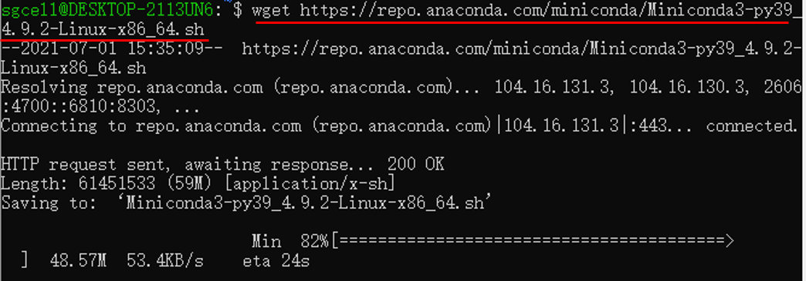
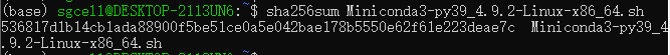
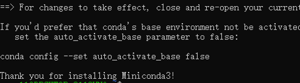
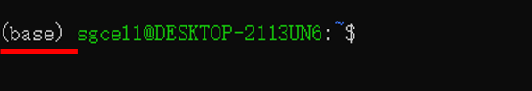
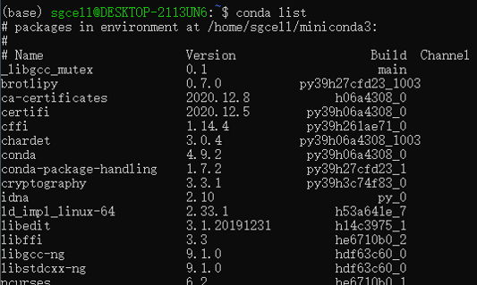

# Prerequisites {#env-pre}

## Quick summary

For this module, a few tools in Python or command line are needed. If you are already familiar with Unix-based command-line interface, you can prepare your environment with this quick summary, otherwise please see detailed instructions below.

For easier installation and cleaner environment, we recommend using  [conda](https://docs.conda.io/en/latest/miniconda.html) (a popular environment management tool) with Python 3.7 here.
After having conda installed, you can create an environment with our pre-defined config file [sgcell.yml](http://ufpr.dl.sourceforge.net/project/sgcellworkshop/sgcell.yml) (click & download it, and move it to the working directory). Then all you need is this command line:
```{shell}
conda env create -f sgcell.yml
```  

Now, you can type `conda env list`. If the environment named `sgcell` is listed, it means you configured the environment successfully (now, enjoy this Module).


## (Optional) Install Windows Subsystem for Linux {#wsl_install}

**Note, this is for Windows users only.** While some required softwares only support Linux or macOS, you could install WSL to use Linux inside Windows.  

If you already have Linux or macOS, you can skip this section and jump directly to the section of `conda installation` [for Linux](#conda_install_linux) or [for macOS](#conda_install_mac).  

The whole process of installing WSL requires at least 2G disk space. Note that this process was tested on Windows 10 (Version 2004, build 19041.1052).  

### What is the Windows Subsystem for Linux (WSL)?

According to the [Microsoft Docs](https://docs.microsoft.com/en-us/windows/wsl/about),  

>*"The Windows Subsystem for Linux lets developers run a GNU/Linux environment -- including most command-line tools, utilities, and applications -- directly on Windows, unmodified, without the overhead of a traditional virtual machine or dualboot setup."*  

### Manual Installation Steps

**Step 1. Enable required feature in Windows PowerShell**

It is necessary to enable the required feature for WSL before installing it.  

- Type `powershell` in the search box of the Windows taskbar.
- Right click `Windows PowerShell` and select `Run as administrator`.

```{r wsl_fig1, echo=FALSE, message=FALSE, warning=FALSE, fig.align="center", out.width="45%"}
knitr::include_graphics("./images/wsl_open_powershell.png")
```  

- Type the command below in PowerShell.  

```{shell}
dism.exe /online /enable-feature /featurename:Microsoft-Windows-Subsystem-Linux /all /norestart

Enable-WindowsOptionalFeature -Online -FeatureName Microsoft-Windows-Subsystem-Linux
```  

```{r wsl_fig2, echo=FALSE, message=FALSE, warning=FALSE, fig.align="center", out.width="60%"}
knitr::include_graphics("./images/wsl_enable_feature.png")
```  

**Step 2. Download and install WSL**

Microsoft now supports several Linux distributions as WSL, such as Ubuntu, openSUSE, Fedora, etc ([a full list here](https://docs.microsoft.com/en-us/windows/wsl/install-win10#step-6---install-your-linux-distribution-of-choice)), among which we choose Ubuntu as an example.  

Ubuntu WSL could be freely downloaded and installed through [Microsoft Store](https://www.microsoft.com/en-us/p/ubuntu-2004-lts/9n6svws3rx71?rtc=1&activetab=pivot:overviewtab).  

- Go to the webpage for [Ubuntu](https://www.microsoft.com/en-us/p/ubuntu-2004-lts/9n6svws3rx71?rtc=1&activetab=pivot:overviewtab) in Microsoft Store.
- Click on the `Get` button.
- Wait for completion of downloading and installation.
- Click on the `Launch` button.

```{r wsl_fig3, echo=FALSE, message=FALSE, warning=FALSE, fig.align="center", out.width="60%"}
knitr::include_graphics("./images/wsl_download_install.png")
```  

**Step 3. Create a new account for Ubuntu**

After successfully installing Ubuntu, a new user account should be created.  

- Type user name and password following the prompts on the screen. Note, it is normal that the password is invisible when you are typing.

```{r wsl_fig4, echo=FALSE, message=FALSE, warning=FALSE, fig.align="center", out.width="40%"}
knitr::include_graphics("./images/wsl_create_account.png")
```  

**Now Congratulations! You have successfully installed and set up Ubuntu in your Windows System!**  

Next time you can re-open Ubuntu through the search box of the Windows taskbar.  

```{r wsl_fig5, echo=FALSE, message=FALSE, warning=FALSE, fig.align="center", out.width="35%"}
knitr::include_graphics("./images/wsl_open_ubuntu.png")
```  

More information about the usage of WSL can be found at [Microsoft Docs](https://docs.microsoft.com/en-us/windows/wsl).  

## Install Conda Environment {#conda_install}

The whole process of installing conda environment requires at least 1G disk space.  

### What is conda?

Conda is part of the Anaconda platform. According to the [Anaconda docs](https://docs.anaconda.com/#anaconda-individual-edition),  

>*"Anaconda Individual Edition is a free, easy-to-install package manager, environment manager, and Python distribution with a collection of 1,500+ open source packages with free community support. Anaconda is platform-agnostic, so you can use it whether you are on Windows, macOS, or Linux."*  

For quick installation and configuration, we choose to install [Miniconda](https://docs.conda.io/en/latest/miniconda.html) instead of the whole Anaconda.  

>*"Miniconda is a free minimal installer for conda. It is a small, bootstrap version of Anaconda that includes only conda, Python, the packages they depend on, and a small number of other useful packages, including pip, zlib and a few others."*  

### Installation on Windows {#conda_install_windows}

Although it is easy to install Miniconda itself on Windows, there are several conda softwares (e.g., bcftools, cellsnp-lite)  required for this workshop that are well-supported only on Unix-Like systems. Linux or macOS is essential to use those softwares.  

Good news is that Microsoft has provided the Windows Subsystem for Linux (WSL), which enables you to use several Linux distributions on Windows 10. The installation of WSL is easy and details can be found [here](#wsl_install).  

After installing WSL, you could follow Section [Installation on Linux](#conda_install_linux) to install Miniconda on WSL.  

### Installation on Linux {#conda_install_linux}

This section is adapted based on Miniconda installation [guides for Linux](https://conda.io/projects/conda/en/latest/user-guide/install/linux.html). In this section, we select the Miniconda with Python 3.9 as an example.  

**Step 1. Open Shell**

- Open Linux Shell / WSL Shell (see Section [Install WSL](#wsl_install) for details of WSL).

**Step 2. Download Miniconda installer**

The Miniconda installer is a `.sh` file containing metadata of installation. Run `wget <installer_link>` to download the installer. e.g.,  

- Type in Shell `wget https://repo.anaconda.com/miniconda/Miniconda3-py39_4.9.2-Linux-x86_64.sh`.  

```{r conda_fig1, echo=FALSE, message=FALSE, warning=FALSE, fig.align="center", out.width='65%'}

```  

You could choose other Miniconda installers based on your platform. A full list of installers can be found [here](https://docs.conda.io/en/latest/miniconda.html).  

**Step 3. Verify your installer hashes (Optional)**

An unmatched hash indicates there were some error during the downloading process. We could simply verify the installer hashes by typing `sha256sum <installer_file>` in the Shell. e.g.,  

- Type `sha256sum Miniconda3-py39_4.9.2-Linux-x86_64.sh` and check if the output hash is `536817d1b14cb1ada88900f5be51ce0a5e042bae178b5550e62f61e223deae7c`.  

```{r conda_fig2, echo=FALSE, message=FALSE, warning=FALSE, fig.align="center", out.width='65%'}

```  

A full list of hashes can be found [here](https://docs.conda.io/en/latest/miniconda.html).  

**Step 4. Initialize Miniconda**

Run `bash <installer_file>` in Shell. e.g.,  

- Type `bash Miniconda3-py39_4.9.2-Linux-x86_64.sh`.  

```{r conda_fig3, echo=FALSE, message=FALSE, warning=FALSE, fig.align="center", out.width='55%'}
knitr::include_graphics("./images/conda_init_conda.PNG")
```  

- Follow the prompts on the installer screens.  

When you are asked `Do you wish the installer to initialize Miniconda3 by running conda init`, we recommend "yes". When the initialization is done, it looks like,  

```{r conda_fig4, echo=FALSE, message=FALSE, warning=FALSE, fig.align="center", out.width='45%'}

```  

**Step 5. Close and re-open Shell**

- Close and then re-open your Shell, to make the changes take effect.

The screen should have a new `(base)` prefix, which looks like,  

```{r conda_fig5, echo=FALSE, message=FALSE, warning=FALSE, fig.align="center", out.width="40%"}

```  

It means the Shell is now in the `base` environment of conda.

**Step 6. Test your installation**

- Type `conda list` in Shell. 

A list of installed packages appears if it has been installed correctly.  

```{r conda_fig6, echo=FALSE, message=FALSE, warning=FALSE, fig.align="center", out.width='50%'}

```  

### Installation on macOS {#conda_install_mac}

You could refer to the Section [Installation on Linux](#conda_install_linux) as the processes of installing Miniconda on macOS and Linux are quite similar. We briefly list the steps here for your quick reference.  

**Step 1. Open macOS Terminal**

**Step 2. Download Miniconda installer**

- Type in Terminal `wget https://repo.anaconda.com/miniconda/Miniconda3-py39_4.9.2-MacOSX-x86_64.sh`.  

**Step 3. Verify your installer hashes (Optional)**

- Type `shasum -a 256 Miniconda3-py39_4.9.2-MacOSX-x86_64.sh` in Terminal and check if the output hash is `b3bf77cbb81ee235ec6858146a2a84d20f8ecdeb614678030c39baacb5acbed1`.

**Step 4. Initialize Miniconda**

- Type in Terminal `bash Miniconda3-py39_4.9.2-MacOSX-x86_64.sh`.

- Follow the prompts on the installer screens.  

When you are asked `Do you wish the installer to initialize Miniconda3 by running conda init`, we recommend "yes".  

**Step 5. Close and re-open Terminal**

**Step 6. Test your installation**

- Type `conda list` in Terminal. 

A list of installed packages appears if it has been installed correctly.  

## Other Preparation


### Conda Configuration

To simplify the configuration of conda environment, we have pre-compiled a conda environment, named `sgcell`, containing some required softwares for this workshop. The corresponding metafile `sgcell.yml` of this environment was exported, based on which we can easily re-build the pre-compiled environment. The `sgcell.yml` can be 
downloaded from [sgcellworkshop](https://sourceforge.net/projects/sgcellworkshop/files/) repo on sourceforge.  

Assuming you have installed conda and activated any environment in the Shell / Terminal (if not, please install conda based on Section [Install Conda Environment](#conda_install) first). Then,

- Open Linux Shell / macOS Terminal / WSL Shell

- Add conda channels,

```{shell}
conda config --add channels bioconda
conda config --add channels conda-forge
```  

- Re-build the pre-compiled environment (**Note that this can fail due to unstable connection to the server, please re-try for several times**).

```{shell}
conda env create -f sgcell.yml
```  

- Activate the new environment `sgcell`,

```{shell}
conda activate sgcell
```

- Verify if the new environment was installed correctly,

```{shell}
conda env list
```  

The `sgcell` sould appear in the listed environments.  

