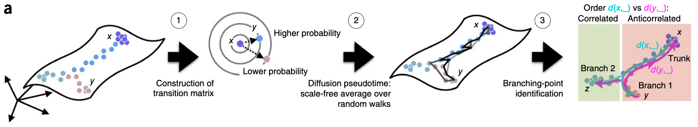
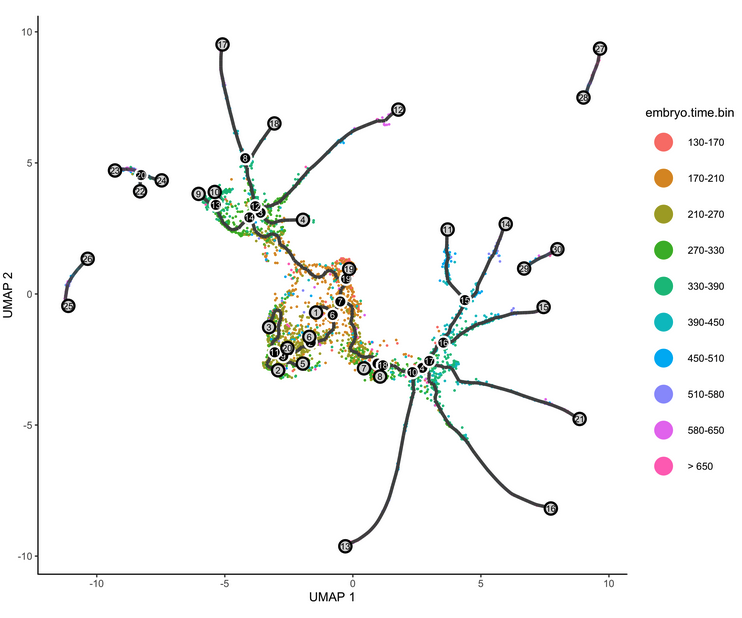

# Trajectory inference and RNA velocity { #RNA_velocity }

Here is the runnable notebook 
[02-RNAvelocity-ntb.Rmd](https://raw.githubusercontent.com/StatBiomed/SingleCell-Workshop-2021/master/notebooks/02-RNAvelocity-ntb.Rmd) (download by right click and "Save Link As")

## Trajectory inference
Generally, dynamical analysis of a biological process is done by performing 
time-series experiments. However, one of bottlenecks is the time resolution
of the experiment, for example it is difficult to have a time gap shorter than
a minute for RNA metabolic experiments. On the other hand, a snapshot of a 
population of cells (namely only single time point) can still capture different
states of a biological process given cells have different speed in the process
or even different fates. Usually, a snapshot represents a relatively transient
dynamical process.

Trajectory inference is type of computational methods to infer the latent time 
(or ordering) of a group of cells in a certain biological processes, for example
cell cycle, cell differentiation, or response to an external stimuli.
According to [Wikipedia](https://en.wikipedia.org/wiki/Trajectory_inference),

>*"Trajectory inference or pseudotemporal ordering is a computational technique used in single-cell transcriptomics to determine the pattern of a dynamic process experienced by cells and then arrange cells based on their progression through the process."*

Trajectory inference remains one of central interests in single-cell 
transcriptomics studies. Its popularity can be seen from large number of 
recently developed tools: in a recent benchmarking study published in Nature
Biotechnology 
[Saelens et al 2019](https://www.nature.com/articles/s41587-019-0071-9), 45 out 
of more than 70 tools have been evaluated.

The topology of the trajectory can be linear, multifurcation, cycle or even 
more complex. The performance of each method on different tasks or data sets
varies a lot. We leave the readers to the original benchmark paper mentioned 
above.


Here, we only introduce two commonly used methods. Note, all above trajectory 
inference methods are based on the current state of transcription and the 
distance between cell are symmetric, namely distance from cell A to cell B is
the same as from cell B to cell A. Therefore, the direction of the inferred 
trajectory is either missing (namely require users to specify) or lack of 
high reliability if using default setting.

### Diffusion map
[Diffusion map](https://en.wikipedia.org/wiki/Diffusion_map) is a type of 
non-linear dimension reduction methods, and is recently applied to estimate the
pseudo-time in single-cell transcriptomic data ([Haghverdi et al 2016](https://www.nature.com/articles/nmeth.3971)).

As shown in Fig. 3.1 (adapted from Haghverdi et al 2016), this algorithm works 
with three steps:

1. computing the overlap of local kernels at the expression levels of cells x 
   and y;
2. Diffusion pseudotime dpt(x,y) approximates the geodesic distance 
   between x and y on the mapped manifold;
3. Branching points are identified as points where anticorrelated distances from
   branch ends become correlated.



### Monocle
Another widely used tool is 
[Monocle (now v3)](https://cole-trapnell-lab.github.io/monocle3/). One of cool
features is that Monocle3 offers is the branching in the trajectory. On the other 
hand, it generally requires users to specify the start (or end) point in the
trajectory.

{ width=100% }

## RNA velocity
### RNA kinetics
As briefly mentioned that the trajectory inferred from the transcriptome often 
suffers from lack of automatically detected direction. 
Very recently, the RNA velocity is introduced to use the 
unspliced RNAs to indicate the transcriptional kinetic activity 
([La Manno et al, 2018](https://www.nature.com/articles/s41586-018-0414-6)), and
recently scVelo is further extends it to full dynamical model
([Bergen et al, 2020](https://www.nature.com/articles/s41587-020-0591-3)).

Let us first review the RNA metabolic process and its intrinsic dynamics:
- RNA is synthesized at a rate of alpha
- RNA is spliced to remove introns and form mature mRNA at rate of beta
- Mature mRNA is degraded after functioning at a rate of gamma

In steady state, the unspliced and spliced is at an equilibrium, namely the 
newly synthesized RNAs are exactly equal to the spliced RNAs, and similarly also 
the degradated RNAs.
Therefore, the break of the equilibrium state between unspliced and spliced RNAs
is highly informative and can indicate whether a gene is in the induction or 
suppression state.


### Unspliced RNA indicates transcriptional speed { #unspliced_RNA }
Usually, the proportion of unspliced RNAs is very low in RNA-seq, especially for
protocols with Poly-A enrichment, which is very common. Namely, in principle, 
only RNAs reaching 3' of the gene body can be captured. However, the unspliced
RNAs still can be observed at a substantial proportion, usually covering 15-25%.
The reason is still highly mysterious, partly biological for co-transcriptional
splicing and partly technical for low efficiency on poly-A capturing.

Recently, there are also a few technologies have also been introduced to enrich the 
nascent RNAs in single-cell protocols, e.g.,
[scSLAM-seq](https://www.nature.com/articles/s41586-019-1369-y) and
[scNT-seq](https://www.nature.com/articles/s41592-020-0935-4).

Though some researchers remain skeptical on the use of RNA velocity, possibly 
because the high noise-by-signal ratio, the unprecedented capability to 
automatically detect the trajectory direction attracts much attention. At the 
same time, we anticipate more accurate and robust methods are coming soon
thanks to the great community-wide efforts.


## scVelo in R
There are two major tools for estimating RNA velocity: 

- [velocyto](http://velocyto.org) is based on a steady-state model. It supports both Python and R.
- [scVelo](https://scvelo.readthedocs.io) supports a full dynamical model and 
various of utility functions. It only supports Python.
  
Here, we will introduce `reticulate` to use the `scvelo` Python package in R 
(sounds cool, right? Hope you will find it handy!)

In order or use `scVelo`, we first need to install it. Please follow 
[Chapter 2.2](env-pre.html) to install Python and `scVelo==0.2.2`.

Generally, the extraction of unspliced RNAs from raw reads is a bit tricky, and 
not widely supported. Please see [Chapter 7.1](preprocess.html) for three tested 
options for mroe details.

In this tutorial, we will download and use the built-in pancreas dataset from 
`scvelo` that has already been preprocssed to count the unspliced RNAs to 
demonstrate the useage of RNA velocity analysis. The dataset will be 
automatically downloaded to `./data/Pancreas/endocrinogenesis_day15.h5ad` 
(52.5MB).

**Note**, this tutorial is translated from its Python version of scvelo at https://scvelo.readthedocs.io/Pancreas/


### Getting started

First, let's use load `reticulate`:

```{r}
# install.packages("reticulate")
library(reticulate)
```

And check `conda` environment available, for example the `sgcell` environment is 
available to use:
```{r}
conda_list()
```

Then use reticulate to import Python packages `scvelo` and `matplotlib`:

```{echo=TRUE, message=TRUE}
use_condaenv("sgcell")
plt <- import("matplotlib.pyplot", as = "plt")
scv <- import ("scvelo")

scv$logging$print_version()
scv$settings$presenter_view = TRUE
scv$settings$verbosity = 3
scv$settings$set_figure_params("scvelo") 
```
  
Endocrine development in pancreas lineage has four major fates: $\alpha$, $\beta$, $\delta$, $\epsilon$. Dataset is obtained and subseted from 
[Bastidas-Ponce et al. (2018)](https://journals.biologists.com/dev/article/146/12/dev173849/19483/Comprehensive-single-cell-mRNA-profiling-reveals-a)
by the scVelo team.

```{}
adata <- scv$datasets$pancreas()
adata
```

Note, to run velocity analysis on your own data, read your file with 
`adata = scv$read(file_path)`.
If you want to save model and parameters after processing, run the following command, `adata$write(file_path, compression = 'gzip')`.  
  
Now, let's have a look of the proportions of unspliced/spliced mRNA reads, 
UMAP embedding and cluster annotations can be printed and visualized using 
built-in functions.  
```{}
# create a folder named "images"
dir.create('images')

scv$utils$show_proportions(adata)
scv$pl$proportions(adata, figsize=c(10, 3), show=FALSE)
plt$savefig('images/RNA-velo-fig1.png')
```
{ width=80% }

```{}
scv$pl$scatter(adata, legend_loc = "best", size = 50, title = "Pancreas Celltype", show=FALSE)
plt$savefig('images/RNA-velo-fig2.png')
```

{ width=75% }

### Data Preprocessing

Preprocessing contains:  
- gene selection by detection (detected with a minimum number of counts)  
- high variability (dispersion)  
- normalizing every cell by its initial size and logarithmizing X  
  
First and second order moments are also computed (mean, uncentered variance for deterministic, stochastic mode respectively) among nearest neighbors in PCA space.  

```{}
scv$pp$filter_and_normalize(adata, min_shared_counts = as.integer(20), n_top_genes = as.integer(2000))
scv$pp$moments(adata, n_pcs = as.integer(30), n_neighbors = as.integer(30))
```

### Diffusion pseudotime

Pseudotime, a part of standardized scRNA-seq analysis pipeline, is also implemented in this package, and can be compared with the `latent time` introduced in dynamical mode.  

```{}
adata$uns$data$iroot <- which.min(adata$obsm['X_umap'][, 1])
scv$tl$diffmap(adata)
scv$tl$dpt(adata)

scv$pl$scatter(adata, color = 'dpt_pseudotime', title = 'pseudotime', color_map = 'gnuplot', colorbar = TRUE, rescale_color = c(0,1), perc=c(2, 98), show=FALSE)
plt$savefig('images/RNA-velo-fig3.png')
```

{ width=75% }


### Compute velocity and velocity graph

scVelo has incorporated 3 modes for velocity estimation:  
- Deterministic  
- Stochastic  
- Dynamical  
  
For deterministic and stochastic mode, the gene-specific velocities are obtained by fitting linear regression ratio (constant transcriptional state) between unspliced/spliced mRNA abundances.  
  
Under linear assumptions, how the `observed abundances deviate from the steady state` regression line is velocity.  

```{}
scv$tl$velocity(adata, mode = "stochastic")
```

To calculate velocity graph, we need to run `velocity_graph()`. Velocity graph is 
the cosine correlation of potential cell transitions with velocity vector in high
dimensional space. It summarizes the possible cell transition states and has 
dimension of ${n}_{obs} * {n}_{obs}$.  

```{}
scv$tl$velocity_graph(adata, sqrt_transform = TRUE)
```

### Diffusion pseudotime with velocity

As mentioned above, the scvelo package support computing Diffusion Pseudotime.
Before, we used cell transition matrix from spliced RNAs only. Now, let's change
the transition matrix to our computed velocity and calculate the diffusion 
pseudotime again. As you will see that the pseudotime is reversed. This is 
thanks to the use of velocity which is based on the intrinsic dynamics.

```{}
scv$tl$velocity_pseudotime(adata)
scv$pl$scatter(adata, color = 'velocity_pseudotime', cmap = 'gnuplot', show=FALSE)
plt$savefig('images/RNA-velo-fig4.png')
```

{ width=75% }


```{}
scv$pl$scatter(adata, x = "velocity_pseudotime", y = c('Actn4', 'Ppp3ca', 'Cpe', 'Nnat'), fontsize = 10, size = 10, legend_loc = 'best', color = 'clusters', figsize=c(12, 10), show=FALSE)
plt$savefig('images/RNA-velo-fig5.png')
```

Also, a few example genes along the pseduo-time.


### Visualise velocity-based trajectory

Velocities are projected onto the specified embedding `basis` and can be visualized in one of the three ways:  
- On single cell level  
- On grid level  
- Streamlines, which is most commonly used  

```{}
scv$pl$velocity_embedding_stream(adata, basis = "umap", color = "clusters", legend_loc = "best", dpi = 150, show=FALSE)
plt$savefig('images/RNA-velo-fig6.png')
```

{ width=75% }


```{}
scv$pl$velocity_embedding(adata, basis = "umap", arrow_length = 3, arrow_size = 2, dpi = 150, show=FALSE)
plt$savefig('images/RNA-velo-fig7.png')
```
<!-- { width=75% } -->

### Interprete Velocity

We could also examine the phase portraits of interested genes to understand how inferred directions are supported by particular genes.  

```{}
scv$pl$velocity(adata, c("Cpe", "Gnao1", "Ins2", "Adk"), ncols = 2, show=FALSE)
plt$savefig('images/RNA-velo-fig8.png')
```


Positive velocity indicates that a gene is up-regulated, which occurs for cells that show higher abundance of unspliced mRNA for that gene than expected in steady state. Conversely, negative velocity indicates that a gene is down-regulated.  

### Velocity in cycling progenitors

The cell cycle detected by RNA velocity, is biologically affirmed by cell cycle scores (standardized scores of mean expression levels of phase marker genes).  

```{}
scv$tl$score_genes_cell_cycle(adata)
scv$pl$scatter(adata, color_gradients = c("S_score", "G2M_score"), smooth = TRUE, perc = c(5, 95), legend_loc="upper center",  show=FALSE)
plt$savefig('images/RNA-velo-fig9.png')
```


### Dynamical Mode and related analysis

Dynamical mode does not necessarily rely on linear assumptions, instead it consider gene-specific rates of transcription, splicing and degradation rates as well as transient cell-states.  
  
To use dynamical mode, we just need to call `colorize("revocer_dynamics()", "#316A9E")` before computing velocity.  

```{}
scv$tl$recover_dynamics(adata)

scv$tl$velocity(adata, mode = "dynamical")
scv$tl$velocity_graph(adata)
```


Latent time of the underlying cellular processes can be recovered via dynamical mode. Based on cells' transcriptional dynamics, latent time approximates the real time experienced by cells as they differentiate.  

Latent time could distinguish temporal position more compared with pseudotime.  

```{}
scv$tl$latent_time(adata)

scv$pl$scatter(adata, color = "latent_time", color_map = "gnuplot", size = 80, basis = "umap")
scv$pl$scatter(adata, x = "latent_time", y = c('Actn4', 'Ppp3ca', 'Cpe', 'Nnat'), fontsize = 10, size = 10, legend_loc = 'best', color = 'clusters')
```


We could also pull out the top genes driving the dynamic RNA velocities.  

```{}
topgenes <- adata$var["fit_likelihood"]
topgenes_vals <- topgenes[, 1]
names(topgenes_vals) <- rownames(topgenes)
topgenes_vals <- sort(topgenes_vals, decreasing = TRUE)
head(topgenes_vals)

scv$pl$scatter(adata, basis = names(topgenes_vals)[1:5], ncols = 5, frameon = FALSE)

scv$pl$heatmap(adata, var_names = names(topgenes_vals), tkey = 'latent_time', n_convolve = as.integer(100), col_color = 'clusters')
```

## Last notes
Through this tutorial, the RNA velocity method has demostrated its unique power
to reveal very detailed cell transitions, impressively the cell cycle trajecotry.

However, when you try it on your own data, sometimes, you may experience 
difficulty to inteprete the results. These difficulties are shared among groups
on campus and across international community. At the moment, we are actively 
work on computational methods, including a few angles:

1. selection of genes with heterogenous transcriptional kinetics (differential
momuntume genes) with our
[BRIE2](https://www.biorxiv.org/content/10.1101/2020.11.04.368019v2) model

2. projection of the high dimentional RNA velocity into a low dimentional space
for denoise and more robust analysis with our 
[veloAE](https://www.biorxiv.org/content/10.1101/2021.03.19.436127v1) model

3. redesign of the scvelo dynamical model to a more generic mathathic function
and biological informed regularisation (method is coming soon).

Feel free to get in touch (yuanhua@hku.hk) if you need advice on RNA velocity 
analysis on your own data / project.

