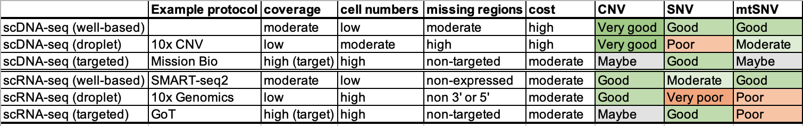
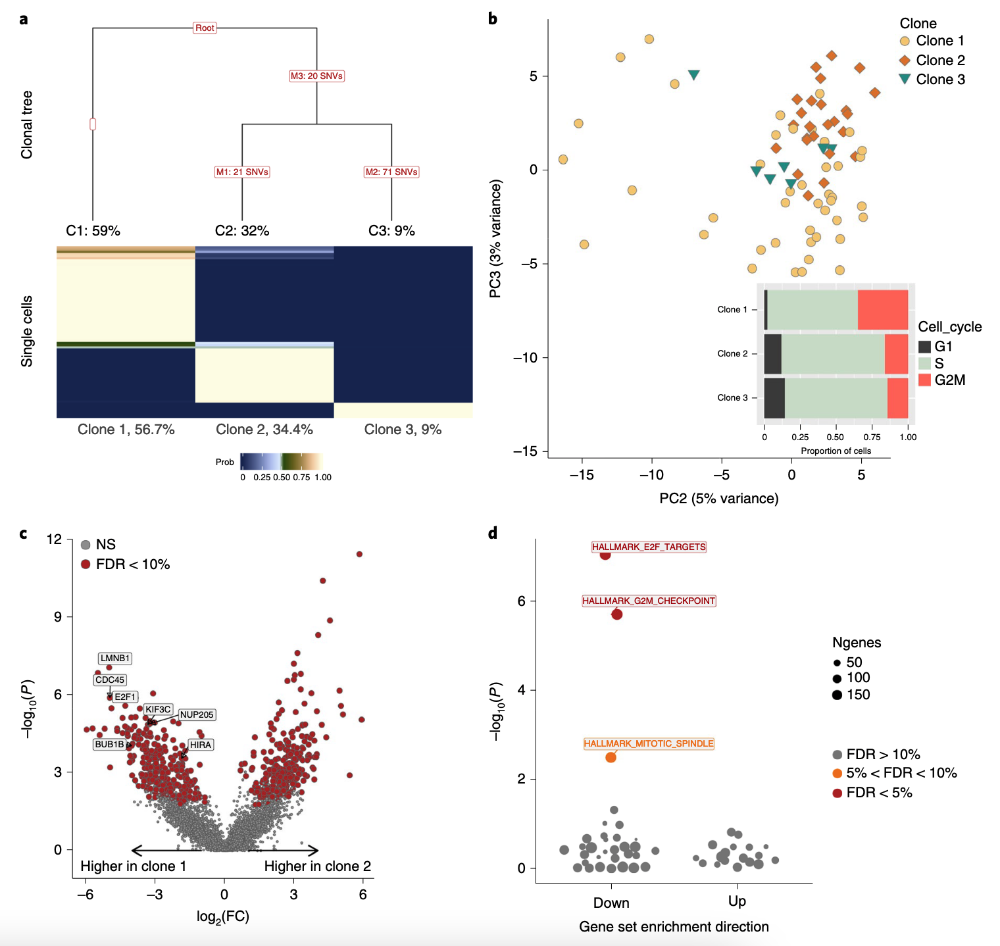
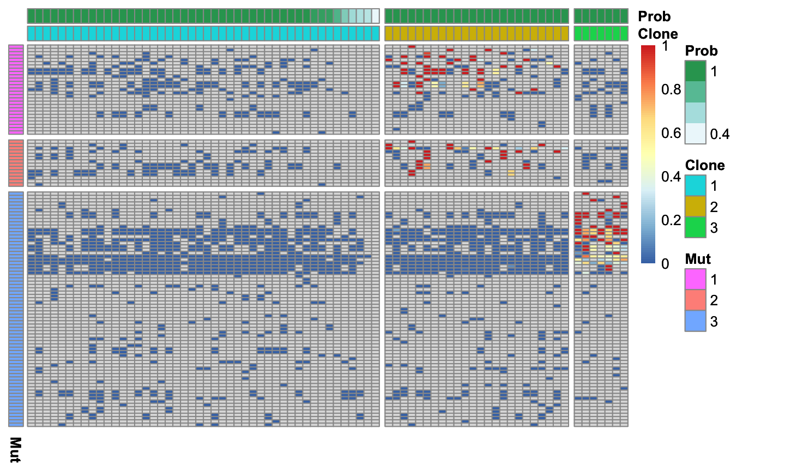
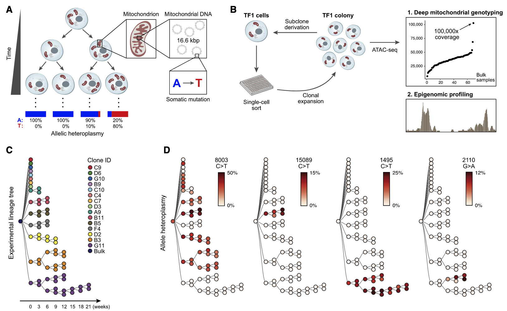

# Somatic mutation analysis in single cells

## Introduction
Whole genome (or exome) sequencing at bulk tissues have been widely used in 
studying somatic mutation in cancer samples and healthy tissues recently. It 
allows to identify somatic mutations and accurately estimate of the frequency of
each mutation (see Fig. 4.1, adapted from 
[Kuipers et al, 2017](https://doi.org/10.1016/j.bbcan.2017.02.001)). 

However, there are a few major challenges in somatic mutations with bulk 
sequencing. 

- First, the allele frequency cannot give accurate clonal structure,
  as it is difficult to distinct mutations from different clones that have 
  similar population percents.
- Second, the evolutionary lineage is much difficult to infer from bulk
  sequencing data without single cell resolution
- Third, the bulk DNA-seq cannot dissect the phenotypic impact of somatic 
  mutations, which however is crucial to understand intra-tumor heterogeneity,
  both at genetic and transcriptomic levels.


### Choice of protocols
Let us first review the different protocols for single-cell sequencing, as 
genetic analysis often higher requirement of sequencing coverage.

In next Figure from 
[Ding et al, 2020](https://www.nature.com/articles/s41587-020-0465-8), there are
major two different types of protocols. One is well based, including SMART-seq, 
returning moderate coverage but low number of cells. The other is droplet-based,
including 10x Genomics, returning extremely low coverage but high number of 
cells.


Though scRNA-seq contains the information of somatic mutations in the expressed
RNA molecules. However, it only covers the highly expressed genes (or its 3' / 
5' if UMI-based protocols). Generally, scDNA-seq offers more even coverage 
across the genome, despite its much higher cost. None the less, given the low
capture efficiency, all protocols suffer from allele drop-out, namely false 
negatives in observing the existing mutation allele.

Below, we summarise different sequenciing strategies and their potentials for 
analysing different types of somatic mutations, including copy number 
variations (CNV), single-nucleotide variation (SNV) and mitochondrial SNV 
(mtSNV).



In the following sections, we will show two example data sets to illustrating:

- SMART-seq2 for SNV and mtSNV analysis
- 10x Genomic for CNV analysis (and possibly mtSNV analysis if lucky)


## SNV analysis
Here, we will use a SMART-seq2 dataset, the joxm dataset (77 QC cells) generated
from [McCarthy et al, 2020](https://www.nature.com/articles/s41592-020-0766-3)),
as an example of SNV analsyis in single cells (Fig. 4.3 below for this donor).
The processed data sets are directly available from its according
[cardelino](https://github.com/single-cell-genetics/cardelino) R package. We 
also prepared the raw data (in `.bam` format) and scripts to generate them in 
the [Appendix Chapter 7.1]() for you to practice the preprocessing steps with 
tools [cellsnp-lit](https://cellsnp-lite.readthedocs.io) and 
[MQuad](https://github.com/single-cell-genetics/MQuad).




### Call somatic variants and genotype single cells
Nuclear genome is large and scRNA-seq is generally noisy, hence making it 
extremely difficult to call somatic SNVs from scRNA-seq data directly. In this
dataset, probably in a general situation, we could detect somatic SNVs using 
bulk whole genome sequencing with tumor and matched normal samples first, e.g.,
with the commonly used 
[MuTect](https://software.broadinstitute.org/cancer/cga/mutect).

In this joxm dataset, we have called ~650 SNVs from bulk whole exome-seq. Given
this list of called somatic variants, we can genotype each cell with genotyping
tool. Here, we used our [cellsnp-lit](https://cellsnp-lite.readthedocs.io) (with
high recommendation).

Finally, we obtained 112 SNVs are expressed in at least one of the 77 cells. The
output file in VCF is available in the cardelino package 
[cellSNP.cells.vcf.gz](https://github.com/single-cell-genetics/cardelino/blob/lite-depends/inst/extdata/cellSNP.cells.vcf.gz) (12KB).


### Visualize variat allele fequency
Now, let's load the data and visualise the allele frequency here:
```{load-pkg}
library(ggplot2)
library(cardelino)
```

```{read-vcf-data}
vcf_file <- system.file("extdata", "cellSNP.cells.vcf.gz", package = "cardelino")
input_data <- load_cellSNP_vcf(vcf_file)
```

```{allele-frequency}
AF <- as.matrix(input_data$A / input_data$D)

p = pheatmap::pheatmap(AF, cluster_rows=FALSE, cluster_cols=FALSE,
                   show_rownames = TRUE, show_colnames = TRUE,
                   labels_row='77 cells', labels_col='112 SNVs',
                   angle_col=0, angle_row=0)
```
{ width=75% }

As expected, the
majority of entries are missing (in grey) due to the high sparsity in scRNA-seq 
data. For the same reason, even for the non-missing entries, the estimate of 
allele frequency is of high uncertainty. Therefore, it is crucial to 
probabilistic clustering with accounting the uncertainty, ideally with guide 
clonal tree structure from external data. 

### Use extra information on clonal tree
As mentioned, the variant calling is based on bulk WES, which can also be used
to infer a clonal tree, even though it is of high uncertainty by only using bulk
data. Here, we obtain a maximum-a-posteriori (MAP) tree from 
[Canopy](https://github.com/yuchaojiang/Canopy).
The clonal tree inferred by Canopy for this donor consists of three clones, 
including a "base" clone ("clone1") that has no sublconal somatic mutations 
present.

```{read-canopy-data}
canopy_res <- readRDS(system.file("extdata", "canopy_results.coveraged.rds", 
                                  package = "cardelino"))
plot_tree(canopy_res$tree, orient = "v")
```
{ width=40% }

### Run cardelino for inferring clonal structure
Now, we can leverage the inferred clonal tree as an guidence to cluster cells
based on their mutation profiles.

Before starting, be careful to ensure that the same variant IDs are used in both 
data sources.

```{correct-variant-ids}
Config <- canopy_res$tree$Z
rownames(Config) <- gsub(":", "_", rownames(Config))
```

The run `clone_id` the main function in `cardelino` package:

```{cell-assign}
set.seed(7)
assignments <- clone_id(input_data$A, input_data$D, Config = Config,
                        min_iter = 800, max_iter = 1200)
names(assignments)
```

We can visualise the cell-clone assignment probabilities as a heatmap.

```{prob-heatmap}
prob_heatmap(assignments$prob)
```
{ width=40% }

We recommend assigning a cell to the highest-probability clone if the highest 
posterior probability is greater than 0.5 and leaving cells "unassigned" if they
do not reach this threshold. The `assign_cells_to_clones` function conveniently
assigns cells to clones based on a threshold and returns a data.frame with the
cell-clone assignments.

```{assign-cell-clone-easy}
df <- assign_cells_to_clones(assignments$prob)
head(df)
table(df$clone)
```


Also, Cardelino will update the guide clonal tree Config matrix (as a prior)
and return a posterior estimate. In the figure below, negative value means the
probability of a certain variant presents in a certain clone is reduced in 
posterior compared to prior (i.e., the input Config). Vice verse for the 
positive values.
```{Config-update}
heat_matrix(t(assignments$Config_prob - Config)) + 
  scale_fill_gradient2() +
  ggtitle('Changes of clonal Config') + 
  labs(x='Clones', y='112 SNVs') +
  theme(axis.text.y = element_blank(), legend.position = "right")
```
{ width=40% }

Finally, we can visualize the results cell assignment and updated mutations 
clonal configuration at the raw allele frequency matrix:

```{results-plot}
AF <- as.matrix(input_data$A / input_data$D)
cardelino::vc_heatmap(AF, assignments$prob, Config, show_legend=TRUE)
```
{ width=75% }

## mtSNV analysis
Recently, mitochondrial variants have also been shown powerful makeups for 
lineage tracing [Ludwig et al, 2019](https://doi.org/10.1016/j.cell.2019.01.022).
The much higher copies of mtDNA not only give much higher sequencing coverage,
but generally highly mutation rate (probably also some other biological reasons).



### Visualise allele frequency
Here, we illustrate the mtDNA on the joxm dataset again. During the preprocssing,
we first genotyping the whole mito genome directly with `cellsnp-lit` and then
call the clonal informed variants by `MQuad`.

Let's first load the processed dataset from `cardelino` package and visualise 
the allele frequency.

```{read-mtx-files}
AD_file <- system.file("extdata", "passed_ad.mtx", package = "cardelino")
DP_file <- system.file("extdata", "passed_dp.mtx", package = "cardelino")
id_file <- system.file("extdata", "passed_variant_names.txt", package = "cardelino")

AD <- Matrix::readMM(AD_file)
DP <- Matrix::readMM(DP_file)
var_ids <- read.table(id_file, )
rownames(AD) <- rownames(DP) <- var_ids[, 1]
colnames(AD) <- colnames(DP) <- paste0('Cell', seq(ncol(DP)))
```

```{show-pheatmap}
AF_mt <- as.matrix(AD / DP)
pheatmap::pheatmap(AF_mt)
```

{ width=75% }

As expected, the coverage of mtDNA is a lot higher than the nuclear genome above
(much fewer missing values).

### Infer clonal structure with mtDNA variants
Now, we can run cardelino on the mitochondrial variations. Note, as there is 
no prior clonal tree, the model is easier to return a local optima. Generally,
we recommend running it multiple time (with different random seed or 
initializations) and pick the one with highest DIC.

```{denovo-mtDNA}
set.seed(7)
assign_mtClones <- clone_id(AD, DP, Config=NULL, n_clone = 3, keep_base_clone=FALSE)
```

Then visualise allele frequency along with the clustering of cells and variants:
```{vc_heatmap-mtDNA}
Config_mt <- assign_mtClones$Config_prob
Config_mt[Config_mt >= 0.5] = 1
Config_mt[Config_mt <  0.5] = 0
cardelino::vc_heatmap(AF_mt, assign_mtClones$prob, Config_mt, show_legend=TRUE)
```

{ width=75% }
