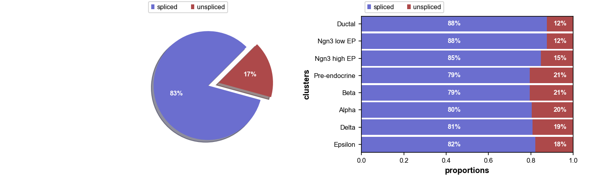
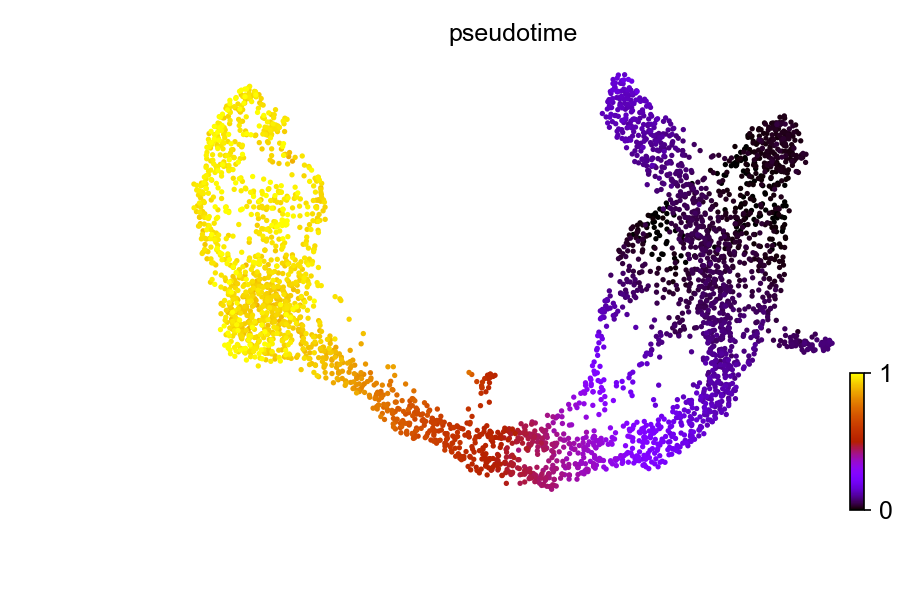
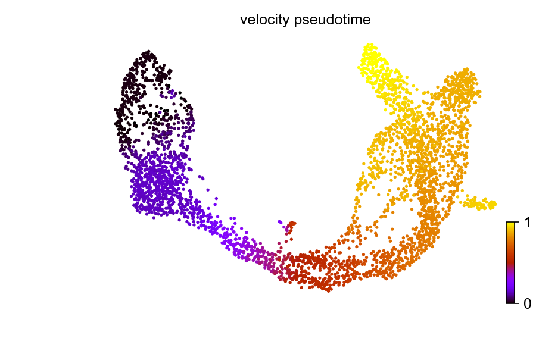
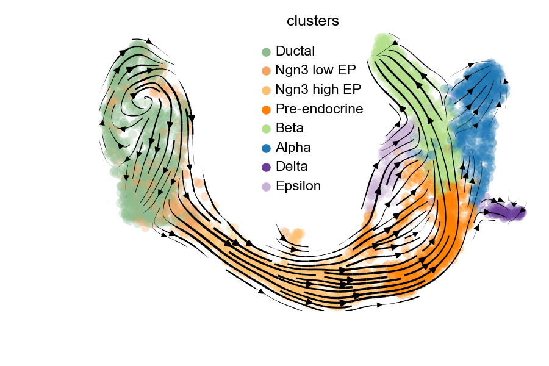
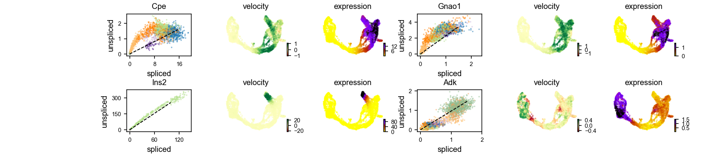

# Trajectory Inference using RNA Velocity


## Use scVelo package within R

First, we need to create a Conda environment and install scVelo afterwards, since scVelo is a Python package,

```{}
conda create -n workshop python=3.7
conda activate workshop
pip install -U scvelo==0.2.2
pip install numba==0.51
```

To use Python packages within R environment, we will need the help of R `colorize("reticulate", "#316A9E")` library,
```{r setup, include=FALSE}
knitr::opts_chunk$set(echo = TRUE)

colorize <- function(x, color) {
  if (knitr::is_latex_output()) {
    sprintf("\\textcolor{%s}{%s}", 
            color, x)
  } 
  else if (knitr::is_html_output()) {
    sprintf("<span style='color: %s;'>%s</span>", 
            color, x)
  } 
  else x
}
```
```{r}
# install.packages("reticulate")
library(reticulate)
```

Now we can load the appropriate Conda environments that with scVelo contained, 

```{r echo=TRUE}
conda_list()
```
```{r echo=TRUE, message=TRUE}
use_condaenv("sgcell")
plt <- import("matplotlib.pyplot", as = "plt")
scv <- import ("scvelo")

scv$logging$print_version()
scv$settings$presenter_view = TRUE
scv$settings$verbosity = 3
scv$settings$set_figure_params("scvelo") 
```


## Endocrine Pancreas

We will download and use the built-in pancreas dataset to demonstrate the useage of RNA velocity analysis.  
  
Endocrine development in pancreas lineage has four major fates: $\alpha$, $\beta$, $\delta$, $\epsilon$. Dataset from [Bastidas-Ponce et al. (2018)](https://journals.biologists.com/dev/article/146/12/dev173849/19483/Comprehensive-single-cell-mRNA-profiling-reveals-a)  

```{r}
adata <- scv$datasets$pancreas()
adata
```

To run velocity analysis on your own data, read your file with `colorize("adata = scv$read(file_path)", "#316A9E")`.  
  
If you want to save model and parameters after processing, run the following command, `colorize("adata$write(file_path, compression = 'gzip')", "#316A9E")`.  
  
Proportions of unspliced/spliced mRNA reads, UMAP embedding and cluster annotations can be printed and visualized using built-in functions.  
```{r}
scv$utils$show_proportions(adata)
scv$pl$proportions(adata, figsize=c(10, 3), show=FALSE)
plt$savefig('images/RNA-velo-fig1.png')
```


```{r}
scv$pl$scatter(adata, legend_loc = "best", size = 50, title = "Pancreas Celltype", show=FALSE)
plt$savefig('images/RNA-velo-fig2.png')
```


## Data Preprocessing

Preprocessing contains:  
- gene selection by detection (detected with a minimum number of counts)  
- high variability (dispersion)  
- normalizing every cell by its initial size and logarithmizing X  
  
First and second order moments are also computed (mean, uncentered variance for deterministic, stochastic mode respectively) among nearest neighbors in PCA space.  

```{r}
scv$pp$filter_and_normalize(adata, min_shared_counts = as.integer(20), n_top_genes = as.integer(2000))
scv$pp$moments(adata, n_pcs = as.integer(30), n_neighbors = as.integer(30))
```

## Pseudotime based on Diffusion Map

Pseudotime, a part of standardized scRNA-seq analysis pipeline, is also implemented in this package, and can be compared with the `colorize("latent time", "#316A9E")` introduced in dynamical mode.  

```{r}
adata$uns$data$iroot <- which.min(adata$obsm['X_umap'][, 1])
scv$tl$diffmap(adata)
scv$tl$dpt(adata)

scv$pl$scatter(adata, color = 'dpt_pseudotime', title = 'pseudotime', color_map = 'gnuplot', colorbar = TRUE, rescale_color = c(0,1), perc=c(2, 98), show=FALSE)
plt$savefig('images/RNA-velo-fig3.png')
```




## Compute velocity and velocity graph

scVelo has incorporated 3 modes for velocity estimation:  
- Deterministic  
- Stochastic  
- Dynamical  
  
For deterministic and stochastic mode, the gene-specific velocities are obtained by fitting linear regression ratio (constant transcriptional state) between unspliced/spliced mRNA abundances.  
  
Under linear assumptions, how the `colorize("observed abundances deviate from the steady state", "#b22e5b")` regression line is velocity.  

```{r}
scv$tl$velocity(adata, mode = "stochastic")
```

To calculate velocity graph, we need to run `colorize("velocity_graph()", "#316A9E")`. Velocity graph is the cosine correlation of potential cell transitions with velocity vector in high dimensional space. It summarizes the possible cell transition states and has dimension of ${n}_{obs} * {n}_{obs}$.  

```{r}
scv$tl$velocity_graph(adata, sqrt_transform = TRUE)
```

## Diffusion-map Pseudotime with velocity

Pseudotime, a part of standardized scRNA-seq analysis pipeline, is also implemented in this package, and can be compared with the `colorize("latent time", "#316A9E")` introduced in dynamical mode.  

```{r}
scv$tl$velocity_pseudotime(adata)
scv$pl$scatter(adata, color = 'velocity_pseudotime', cmap = 'gnuplot', show=FALSE)
plt$savefig('images/RNA-velo-fig4.png')
```




```{r}
scv$pl$scatter(adata, x = "velocity_pseudotime", y = c('Actn4', 'Ppp3ca', 'Cpe', 'Nnat'), fontsize = 10, size = 10, legend_loc = 'best', color = 'clusters', figsize=c(12, 10), show=FALSE)
plt$savefig('images/RNA-velo-fig5.png')
```


## Plot Results

Velocities are projected onto the specified embedding `colorize("basis", "#316A9E")` and can be visualized in one of the three ways:  
- On single cell level  
- On grid level  
- Streamlines, which is most commonly used  


```{r}
scv$pl$velocity_embedding_stream(adata, basis = "umap", color = "clusters", legend_loc = "best", dpi = 150, show=FALSE)
plt$savefig('images/RNA-velo-fig6.png')
```




```{r}
scv$pl$velocity_embedding(adata, basis = "umap", arrow_length = 3, arrow_size = 2, dpi = 150, show=FALSE)
plt$savefig('images/RNA-velo-fig7.png')
```


## Interprete Velocity

We could also examine the phase portraits of interested genes to understand how inferred directions are supported by particular genes.  

```{r}
scv$pl$velocity(adata, c("Cpe", "Gnao1", "Ins2", "Adk"), ncols = 2, show=FALSE)
plt$savefig('images/RNA-velo-fig8.png')
```



Positive velocity indicates that a gene is up-regulated, which occurs for cells that show higher abundance of unspliced mRNA for that gene than expected in steady state. Conversely, negative velocity indicates that a gene is down-regulated.  

## Velocity in cycling progenitors

The cell cycle detected by RNA velocity, is biologically affirmed by cell cycle scores (standardized scores of mean expression levels of phase marker genes).  

```{r}
scv$tl$score_genes_cell_cycle(adata)
scv$pl$scatter(adata, color_gradients = c("S_score", "G2M_score"), smooth = TRUE, perc = c(5, 95), legend_loc="upper center",  show=FALSE)
plt$savefig('images/RNA-velo-fig9.png')
```


## Dynamical Mode and related analysis

Dynamical mode does not necessarily rely on linear assumptions, instead it consider gene-specific rates of transcription, splicing and degradation rates as well as transient cell-states.  
  
To use dynamical mode, we just need to call `colorize("revocer_dynamics()", "#316A9E")` before computing velocity.  

```{}
scv$tl$recover_dynamics(adata)

scv$tl$velocity(adata, mode = "dynamical")
scv$tl$velocity_graph(adata)
```


Latent time of the underlying cellular processes can be recovered via dynamical mode. Based on cells' transcriptional dynamics, latent time approximates the real time experienced by cells as they differentiate.  

Latent time could distinguish temporal position more compared with pseudotime.  

```{}
scv$tl$latent_time(adata)

scv$pl$scatter(adata, color = "latent_time", color_map = "gnuplot", size = 80, basis = "umap")
scv$pl$scatter(adata, x = "latent_time", y = c('Actn4', 'Ppp3ca', 'Cpe', 'Nnat'), fontsize = 10, size = 10, legend_loc = 'best', color = 'clusters')
```


We could also pull out the top genes driving the dynamic RNA velocities.  

```{}
topgenes <- adata$var["fit_likelihood"]
topgenes_vals <- topgenes[, 1]
names(topgenes_vals) <- rownames(topgenes)
topgenes_vals <- sort(topgenes_vals, decreasing = TRUE)
head(topgenes_vals)

scv$pl$scatter(adata, basis = names(topgenes_vals)[1:5], ncols = 5, frameon = FALSE)

scv$pl$heatmap(adata, var_names = names(topgenes_vals), tkey = 'latent_time', n_convolve = as.integer(100), col_color = 'clusters')
```

## Session Info

```{r}
sessionInfo()
```

