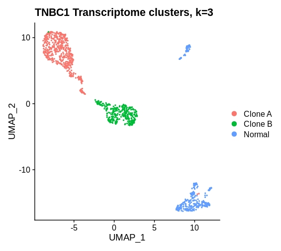
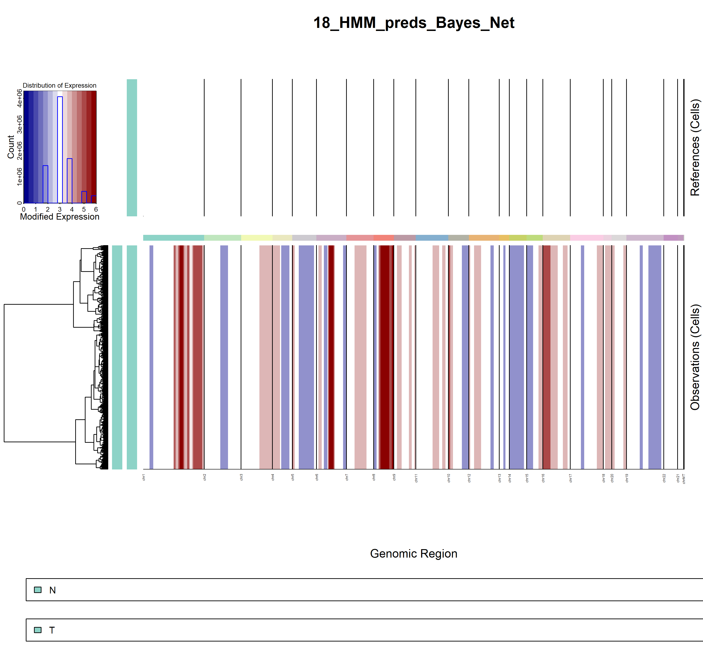
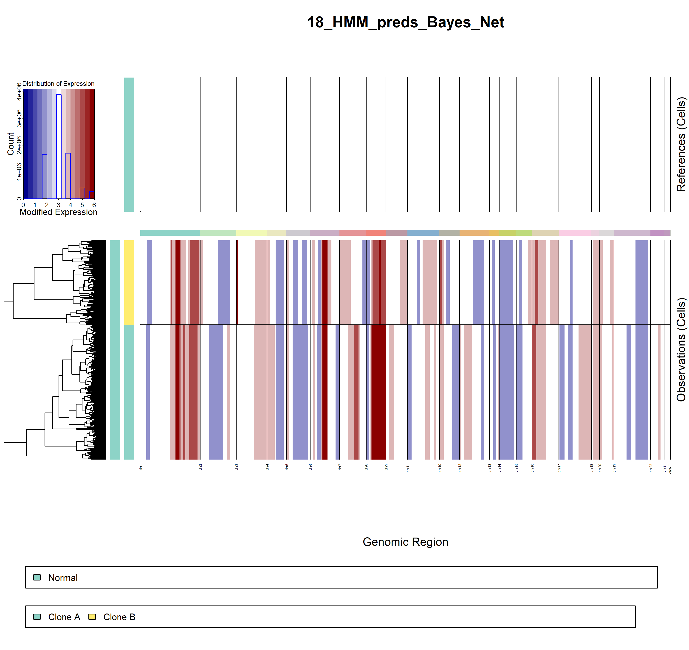

# Copy number variation estimation from scRNA-seq

Rongting Huang

2021-06-29

## Method: inferCNV

[InferCNV: Inferring copy number alterations from tumor single cell RNA-Seq data](https://github.com/broadinstitute/inferCNV/wiki)

### install inferCNV
**Software Requirements**

- [JAGS](https://mcmc-jags.sourceforge.io/)
- R (>3.6)

In order to run infercnv, JAGS (Just Another Gibbs Sampler) must be installed.

Download JAGS from <https://sourceforge.net/projects/mcmc-jags/files/JAGS/4.x/> and install JAGS in your environment (windows/MAC).

If you use inferCNV on server, install JAGS via `conda install` in your conda environment is recommended.

```
conda install -c conda-forge jags
```

More details refer to [inferCNV wiki page](https://github.com/broadinstitute/inferCNV/wiki)

**Five options for installing inferCNV**

Option A: Install infercnv from BioConductor (preferred)
```
if (!requireNamespace("BiocManager", quietly = TRUE))
     install.packages("BiocManager")
BiocManager::install("infercnv")
```

For more other options, refer to [Five options for installing inferCNV](https://github.com/broadinstitute/inferCNV/wiki/Installing-infercnv)

**Data requirements**

- a raw counts matrix of single-cell RNA-Seq expression
- an annotations file which indicates which cells are tumor vs. normal.
- a gene/chromosome positions file

[File-Definitions](https://github.com/broadinstitute/inferCNV/wiki/File-Definitions)


### getting started

If you have installed infercnv from BioConductor, you can run the example data with:

```
library(infercnv)

infercnv_obj = CreateInfercnvObject(raw_counts_matrix=system.file("extdata", "oligodendroglioma_expression_downsampled.counts.matrix.gz", package = "infercnv"),
                                    annotations_file=system.file("extdata", "oligodendroglioma_annotations_downsampled.txt", package = "infercnv"),
                                    delim="\t",
                                    gene_order_file=system.file("extdata", "gencode_downsampled.EXAMPLE_ONLY_DONT_REUSE.txt", package = "infercnv"),
                                    ref_group_names=c("Microglia/Macrophage","Oligodendrocytes (non-malignant)")) 

infercnv_obj = infercnv::run(infercnv_obj,
                             cutoff=1, # cutoff=1 works well for Smart-seq2, and cutoff=0.1 works well for 10x Genomics
                             out_dir=tempfile(), 
                             cluster_by_groups=TRUE, 
                             denoise=TRUE,
                             HMM=TRUE)
```

If you can run the getting started part with demo data provided by inferCNV, then it is installed successfully.


**Demo Example Figure**


## Application on TNBC1

### data description

TNBC1 is a triple negative breast cancer tumor sample of high tumor purity (72.6%) with 796 single tumor cells and 301 normal cells. The dataset is available on NCBI GEO under the accession number GSM4476486.

: Details of TNBC1 dataset (from published articles, copyKAT).

+-------------------------------+--------------------+-----------------------+------------------------------------+
| TNBC1                         | Number of clones   | Number of tumor clones|  Tumor clone-specific copy gain    |
+===============================+====================+=======================+====================================+
| Triple negative breast cancer |         3          |             2         | - C1: 4p, 7q, 9, 17q               |
|                               |                    |                       | - C2: 3p, 6q, 7p, 11q, X           |
+-------------------------------+--------------------+-----------------------+------------------------------------+


- Expression

Clone A       Clone B       Normal
------        ------        ------
488           307           302

Table:  Subclusters of TNBC1 dataset (from gene expression analysis-Seurat).





- B Allele Frenquency (BAF)

{width=120%}

{width=120%}

{width=120%}


### run inferCNV


[demo1_log_file](https://github.com/Rongtingting/SingleCell-Workshop-2021/blob/master/CNV_analysis_file/demo1_inferCNV_TNBC1.log)

[demo2_log_file](https://github.com/Rongtingting/SingleCell-Workshop-2021/blob/master/CNV_analysis_file/demo2_inferCNV_TNBC1.log)

```{r}
# library(infercnv)
# library(utils)
# library (BiocGenerics)

## DEMO1
# 
# tnbc <- read.delim("C://Users/Rongting/Documents/GitHub_repos/combinedTNBC1.txt")
# anno <- tnbc[2,]
# anno <- t(anno)
# anno <- as.data.frame(anno)
# 
# gex <- tnbc[-c(1:2),]
# gex <- type.convert(gex)
# 
# gene_file <- "C://Users/Rongting/Documents/GitHub_repos/gene_note_noheader_unique.txt"

# 
# infercnv_obj = CreateInfercnvObject(raw_counts_matrix=gex,
#                                     annotations_file=anno,
#                                     delim='\t',
#                                     gene_order_file=gene_file,
#                                     ref_group_names= "N")

# output = "C://Users/Rongting/Documents/GitHub_repos/tnbc1_demo"

# infercnv_obj = infercnv::run(infercnv_obj,
#                              cutoff=0.1,  
#                              out_dir= output , 
#                              cluster_by_groups=T,   
#                              denoise=T,
#                              HMM=T)

## DEMO2

# gene_file <- "C://Users/Rongting/Documents/GitHub_repos/gene_note_noheader_unique.txt"
# 
# anno_file <- 'C://Users/Rongting/Documents/GitHub_repos/tnbc-3cluster-id.txt'
# 
# infercnv_obj2 = CreateInfercnvObject(raw_counts_matrix=gex,
#                                     annotations_file=anno_file,
#                                     delim='\t',
#                                     gene_order_file=gene_file,
#                                     ref_group_names= "Normal")
# 
# output = "C://Users/Rongting/Documents/GitHub_repos/tnbc1_demo2"
# 
# infercnv_obj2 = infercnv::run(infercnv_obj2,
#                              cutoff=0.1,
#                              out_dir= output,
#                              cluster_by_groups=T,
#                              denoise=T,
#                              HMM=T)


```


```
#################
##Notes
#################

## load the package
library(Seurat)
library(infercnv)

## prepare the data (cellranger output)

### load count matrix (example)
matrix_path <- "../cellranger/xxxx/count_xxxxx/outs/filtered_gene_bc_matrices/GRCh38/"


### read count matrix
gex_mtx <- Seurat::Read10X(data.dir = matrix_path)

### run inferCNV with loop
celltype = c('CloneA', 'CloneB', 'Normal')

for (i in celltype){
  infercnv_obj1 = CreateInfercnvObject(raw_counts_matrix=gex_mtx,
                                       annotations_file=anno_file,
                                       delim='\t',
                                       gene_order_file=gene_file,
                                       ref_group_names=c(i))
  
  output <- paste0('/groups/cgsd/rthuang/processed_data/inferCNV/xxxx/','xxxx_', i)
  
  infercnv_obj1 = infercnv::run(infercnv_obj1,
                                cutoff=0.1,  
                                out_dir= output , 
                                cluster_by_groups=T,   
                                denoise=T,
                                HMM=T)
}

```


### inferCNV result

- demo1





- demo2





## ref


https://www.r-bloggers.com/2012/04/getting-started-with-jags-rjags-and-bayesian-modelling/

```
bookdown::render_book("index.Rmd", "bookdown::gitbook")
```


