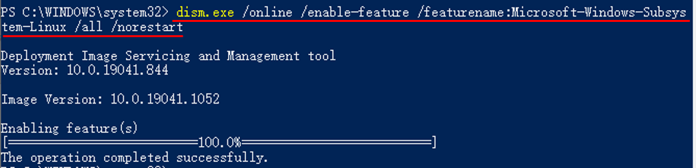
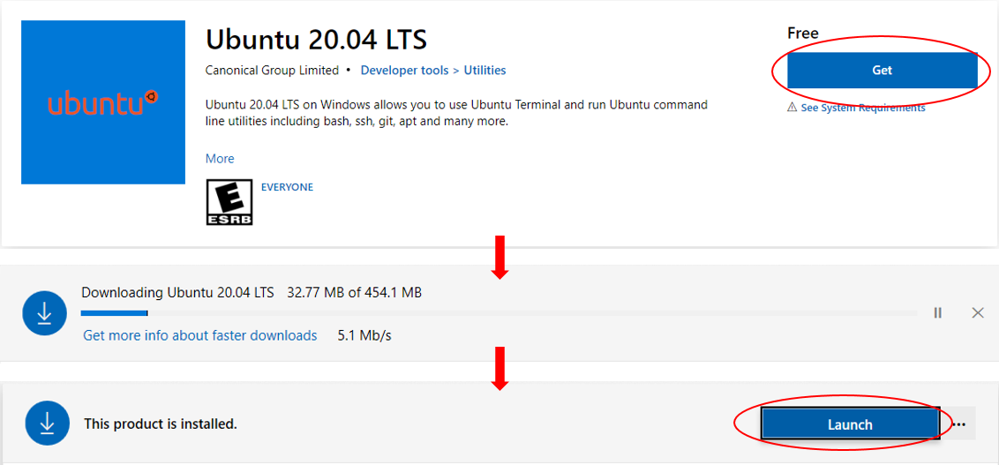
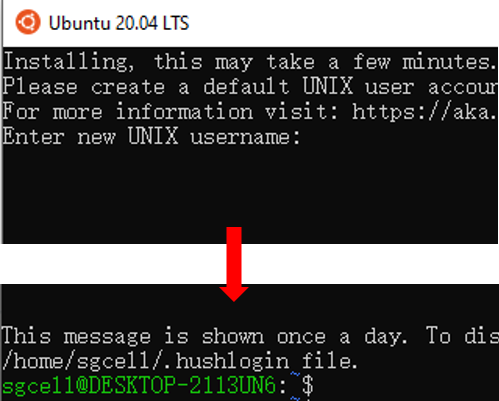
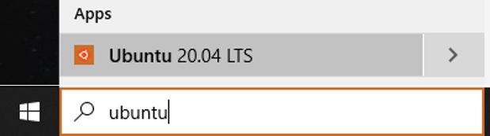

# Preprocessing of dataset { #preprocess }

## Preprocessing for RNA Velocity

There are three options we have tried (more exist, e.g., kallisto bustools):

- [velocyto.py](http://velocyto.org): the earliest software for this purpose. 
  Generally not computationally efficient, possible due to written in Python. 
  For unknown reason, the proportion of unspliced RNA is unrealisticly high for
  5' 10x Genomics data.
- [dropEst](https://dropest.readthedocs.io): as implemented in C/C++, it is much
  more efficient. It also returns more reasonable proportion of unspliced RNAs 
  for 5' 10x Genomics data
- [STAR-solo](https://github.com/alexdobin/STAR/blob/master/docs/STARsolo.md):
  new extension for the popular STAR. Benefits: efficient and one step for reads
  alignment and counting of unspliced RNA (**Recommended option**)

**Please always read the manual of a specific software you are using.**

In this tutorial, we would take the Pancreas dataset used in scVelo paper for example, show how to retrieve the fastq dataset from NCBI, process using cellranger, velocyto or dropest to obtain the spliced and unspliced count matrices for RNA velocity estimation.

### List of packages aligned in pipeline:

1. [SRATool](https://github.com/ncbi/sra-tools/wiki/02.-Installing-SRA-Toolkit): for downlowding datasets from NCBI, Pancreas dataset E15_5 with SRA id SRR9201794
2. [Cellranger](https://support.10xgenomics.com/single-cell-gene-expression/software/downloads/latest): for counting, analyzing, QA on fastqs, outputs input for velocyto/dropest
3. Alternative tools for counting spliced and unspliced reads from Cellranger outputs/
   - [Velocyto](http://velocyto.org/velocyto.py/tutorial/cli.html#introduction)
       - [samtools](http://www.htslib.org/): Velocyto's dependency pakcage 
   - [dropest](https://dropest.readthedocs.io/en/latest/dropest.html)

### Installation of packages/softwares

All the codes are executed on Linux commandline, lines starting with "#" are comments.
My working path root is "/data/users/cqiao/share/",
you may change to any foler as you like.

#### SRATool
Refer to [This tutorial](https://akiomiyao.github.io/ped/sratoolkit/index.html) for step 3. software configuration

```
# 1. download software
wget http://ftp-trace.ncbi.nlm.nih.gov/sra/sdk/current/sratoolkit.current-ubuntu64.tar.gz
# 2. extract package
tar -xzf sratoolkit.tar.gz
# 3. configuration software
./sratoolkit.2.11.0-ubuntu64/vdb-config --interactive
# 4. add software to system path so that we can easily call it
export PATH=$PATH:/data/users/cqiao/share/sratoolkit.2.11.0-ubuntu64/bin/
# 5. test installation, expected to output some sequencing results
fastq-dump --stdout -X 2 SRR390728
```

#### Cellranger

```
# 1. download software
wget -O cellranger-6.0.2.tar.gz "https://cf.10xgenomics.com/releases/cell-exp/cellranger-6.0.2.tar.gz?Expires=1625079682&Policy=eyJTdGF0ZW1lbnQiOlt7IlJlc291cmNlIjoiaHR0cHM6Ly9jZi4xMHhnZW5vbWljcy5jb20vcmVsZWFzZXMvY2VsbC1leHAvY2VsbHJhbmdlci02LjAuMi50YXIuZ3oiLCJDb25kaXRpb24iOnsiRGF0ZUxlc3NUaGFuIjp7IkFXUzpFcG9jaFRpbWUiOjE2MjUwNzk2ODJ9fX1dfQ__&Signature=Ez05ie1~xJTrUhsc3Q1nZ3JemF5Jc2k3zOOC2PlJiI80TI8YOxM3vVXli90ib1Kl4WgQFRl5~Wp-ce5m2gVAyywGf9juiMk3kW2WGz7xy3DN9nCG-he0rNLvbknDXgkqkj8HeirWyt-EvGgsaqBRZZx7GppGl~MGQOseLTF7DMpJaIm-qwU-72mkVzDy0vKrYVZ~Uiqnlr0M2Hhx14lPwm6QocBuSaKLkmcuZosN4TIS05Z~GPHYt9hQWkykvY4oyd5Y~tyTaMOM8ozVVdI7KgCfc2PmQvhr1bMuhUaEPa3skigzAFjIezbw-fXW3Z8jplwj4lAQ0LybI03ozZr6jg__&Key-Pair-Id=APKAI7S6A5RYOXBWRPDA"
# 2. extract files
tar -xzf cellranger-6.0.2.tar.gz
# 3. add software to system path so that we can easily call it
export PATH=$PATH:/data/users/cqiao/share/cellranger-6.0.2
# 4. download gene refereces (optional saving path: ./cellranger/gtfs/)
cd cellranger-6.0.2
mkdir gtfs
cd gtfs
# human (optional for your needs)
wget https://cf.10xgenomics.com/supp/cell-exp/refdata-gex-GRCh38-2020-A.tar.gz
tar -xzf refdata-gex-GRCh38-2020-A.tar.gz
# mouse (we shall use this for Pancreas dataset)
wget https://cf.10xgenomics.com/supp/cell-exp/refdata-gex-mm10-2020-A.tar.gz
tar -xzf refdata-gex-mm10-2020-A.tar.gz

```

#### Velocyto & Samtools

##### [Samtools](http://www.htslib.org/download/)

```
# 1. download & extract software
wget https://github.com/samtools/samtools/releases/download/1.12/samtools-1.12.tar.bz2
tar -jxvf samtools-1.12.tar.bz2
cd samtools-1.12
# 2. configure build, specify --prefix to locate the root dir
./configure --prefix=/data/users/cqiao/share/samtools
# 3. compile and install software
make
make install
# 4. add software to system path so that we can easily call it
PATH=$PATH:/data/users/cqiao/share/samtools/bin/

# go back to parant folder
cd ..

```

##### [Velocyto](http://velocyto.org/velocyto.py/install/index.html)
Assume your python packages are managed by conda and pip

```
# install dependent packages, may also use pip
conda install numpy scipy cython numba matplotlib scikit-learn h5py click
# install velocyto
pip install velocyto

```

#### [Dropest](https://dropest.readthedocs.io/en/latest/setup.html)
Install dependent libraries

Install RPackages (in R)

```
install.packages(c("Rcpp","RcppEigen", "RInside", "Matrix"))
```

Setup a local lib path:

```
export LOCAL_LIBS=/data/users/cqiao/share/local
mkdir $LOCAL_LIBS
export PATH=$LOCAL_LIBS/bin:$LOCAL_LIBS/usr/local/bin/:$PATH
```

Install CMake
```
wget https://cmake.org/files/v3.12/cmake-3.12.0-rc1.tar.gz
tar xvf cmake-3.12.0-rc1.tar.gz
cd cmake-3.12.0-rc1

./bootstrap --prefix=$LOCAL_LIBS
make
make install
cd ..
```

Zlib
```
wget https://zlib.net/zlib-1.2.11.tar.gz
tar xvf zlib-1.2.11.tar.gz
cd zlib-1.2.11

./configure --prefix=$LOCAL_LIBS
make
make install
cd ..
```

BamTools
```
git clone https://github.com/pezmaster31/bamtools.git
cd bamtools

mkdir build && cd build
cmake ../
make
make install DESTDIR=$LOCAL_LIBS
cd ..
```

Bzip2
```
wget https://www.sourceware.org/pub/bzip2/bzip2-latest.tar.gz
tar -xzvf bzip2-latest.tar.gz
cd bzip2-1.0.8

make -f Makefile-libbz2_so
make install PREFIX=$LOCAL_LIBS
cp -a libbz2.so* $LOCAL_LIBS/lib/
ln -s $LOCAL_LIBS/lib/libbz2.so.1.0 $LOCAL_LIBS/lib/libbz2.so
cd ..
```

Boost
```
wget http://sourceforge.net/projects/boost/files/boost/1.60.0/boost_1_60_0.tar.gz
tar xzf boost_1_60_0.tar.gz
cd boost_1_60_0

./bootstrap.sh
./b2 cxxflags="-std=c++11" include="$LOCAL_LIBS/include/" search="$LOCAL_LIBS/lib/" link=shared threading=multi install --prefix=$LOCAL_LIBS
cd ..
```

DropEst
```
git clone https://github.com/hms-dbmi/dropEst.git
mkdir dropEst/build
cd dropEst/build
cmake -D CMAKE_INSTALL_PREFIX="/data/users/cqiao/share/dropesttool" .. && make
export PATH=$PATH:/data/users/cqiao/share/dropesttool/bin/
```


### Preprocessing pipline

#### 1. Download and split Pancreas E15_5 fastq data from NCBI:

```
fasterq-dump --split-files SRR9201794
```

Result would be:
```
SRR9201794_1.fastq SRR9201794_2.fastq
```

Rename files for cellranger:
```
mv SRR9201794_1.fastq SRR9201794_S1_L001_R1_001.fastq
mv SRR9201794_2.fastq SRR9201794_S1_L001_R2_001.fastq
```

Optinally, move them to a folder `/data/users/cqiao/share/E15_5`


#### 2. Run Cellranger count, referring to the mouse refdata
```
cellranger count --id=pancreas_E15_5 \
--fastqs=/data/users/cqiao/share/E15_5 \
--transcriptome=/data/users/cqiao/share/cellranger-6.0.2/gtfs/refdata-gex-mm10-2020-A

```

`--id` specifies the output dir, the output root.

#### 3. Run Velocyto/Dropest.
   prepare some variables to store path names, so that afterwards we do not need to use the long names.
   
   ```
   # Barchodes if cellranger output files: 
   gzip -d ./pancreas_E15_5/outs/filtered_feature_bc_matrix/barcodes.tsv.gz
   BARCODES=./pancreas_E15_5/outs/filtered_feature_bc_matrix/barcodes.tsv

   # Bam file
   BAMFILE=./pancreas_E15_5/outs/possorted_genome_bam.bam

   # transcriptome reference
   GTF=/data/users/cqiao/share/cellranger-6.0.2/gtfs/refdata-gex-mm10-2020-A/genes/genes.gtf
   ```
   
   
   - __Velocyto__
     ```
     velocyto run -b $BARCODES -o ./velocyto_res $BAMFILE $GTF
     
     ```
     Results are stored in `./velocyto_res/XXX.loom`
     
   - __Dropest__
     
     Requires a .xml configuration file specifying the platform settings for sequencing data. Template configure file could be downloaded [here](https://github.com/kharchenkolab/dropEst/tree/master/configs). We shall use 10x.xml for Pancreas E15_5 dataset. Replace line 64 with the path of 10x.xml:
     ```
     ...
            <barcodes_file>./pancreas_E15_5/outs/filtered_feature_bc_matrix/barcodes.tsv</barcodes_file>
     ...
     ```
     Then execute the following code:
     ```
     $bin/dropest -f -V -g $GTF -c $config_file $BAMFILE
     ```
     Results are stored in file `./pancreas_E15_5/dropEst/cell.counts.matrices.rds`.

## Preprocessing for somatic mutation analysis { #preprocess_mutations }

### Pileup with cellsnp-lite

Cellsnp-lite is designed to perform efficient pileup and genotyping for both bulk and single cell sequencing data. It could be easily installed via [conda](#conda_install) with `conda install -c bioconda -c conda-forge cellsnp-lite`. Note that, cellsnp-lite does not support Windows, but you can use it with the help of the `Windows Subsystem for Linux (WSL)`. Details about WSL can be found in section below.

We use a SMART-seq2 dataset as an example, which were packed into `joxm.bam.all.77.tar.gz` (77 bam files, ~3.5G in total; [McCarthy et al, 2020](https://www.nature.com/articles/s41592-020-0766-3)). 

First, please download `joxm.bam.all.77.tar.gz`, `joxm.hg19.bam.lst` and `joxm.sample.lst` from [sgcellworkshop](https://sourceforge.net/projects/sgcellworkshop/files/mtDNA_analysis/) repo on sourceforge. Put the three files in the same directory. Then unpack the bam files with command `tar zxvf joxm.bam.all.77.tar.gz`. The bam files, together with the `.bai` files, should be in the `sort/` directory.  

#### Pileup without given SNPs

In this example, we use cellsnp-lite to pileup chrM on the bam files without a given SNP list (in denovo mode), whose output could be used as inputs of MQuad model for mitochondrial clone analysis.

Note that the pileup results `joxm.hg19.cellsnp.mode2b.tar.gz` can be downloaded from [sgcellworkshop](https://sourceforge.net/projects/sgcellworkshop/files/mtDNA_analysis/) repo on sourceforge and then unpacked with command `tar zxvf joxm.hg19.cellsnp.mode2b.tar.gz`.

The command line to generate the results is,

```{shell}
cellsnp-lite      \
  -S ./joxm.hg19.bam.lst    \
  -i ./joxm.sample.lst      \
  -O ./cellsnp2b            \
  --chrom MT        \
  --cellTAG None    \
  --UMItag None     \
  --minCOUNT 20     \
  --minMAF 0        \
  --genotype        \
  --gzip
```

#### Pileup with given SNPs

This time, we use cellsnp-lite to pileup given SNPs on the bam files. The 112 SNPs, stored in `joxm.hg19.somatic.sites.vcf`, were somatic SNPs called in ([McCarthy et al, 2020](https://www.nature.com/articles/s41592-020-0766-3)) and can be downloaded from [sgcellworkshop](https://sourceforge.net/projects/sgcellworkshop/files/mtDNA_analysis/) repo. 

Note that the pileup results `joxm.hg19.somatic.cellsnp.mode1b.tar.gz` can be downloaded from [sgcellworkshop](https://sourceforge.net/projects/sgcellworkshop/files/mtDNA_analysis/) repo on sourceforge and then unpacked with command `tar zxvf joxm.hg19.somatic.cellsnp.mode1b.tar.gz`.

The command line to generate the results is,

```{shell}
cellsnp-lite      \
  -S ./joxm.hg19.bam.lst    \
  -i ./joxm.sample.lst      \
  -O ./cellsnp1b            \
  -R ./joxm.hg19.somatic.sites.vcf \
  --cellTAG None    \
  --UMItag None     \
  --minCOUNT 0     \
  --minMAF 0        \
  -p 4              \
  --genotype        \
  --gzip
```

### Clonal analysis with MQuad

The command line below is used to generate the MQuad results:

```{shell}
mquad -c ./cellsnp2b -o ./mquad_dat -p 4
```

## (Optional) Install Windows Subsystem for Linux {#wsl_install}

**Note, this is for Windows users only.** While some required softwares only support Linux or macOS, you could install WSL to use Linux inside Windows.  

The whole process of installing WSL requires at least 2G disk space. Note that this process was tested on Windows 10 (Version 2004, build 19041.1052).  

### What is the Windows Subsystem for Linux (WSL)?

According to the [Microsoft Docs](https://docs.microsoft.com/en-us/windows/wsl/about),  

>*"The Windows Subsystem for Linux lets developers run a GNU/Linux environment -- including most command-line tools, utilities, and applications -- directly on Windows, unmodified, without the overhead of a traditional virtual machine or dualboot setup."*  

### Manual Installation Steps

**Step 1. Enable required feature in Windows PowerShell**

It is necessary to enable the required feature for WSL before installing it.  

- Type `powershell` in the search box of the Windows taskbar.
- Right click `Windows PowerShell` and select `Run as administrator`.

```{r wsl_fig1, echo=FALSE, message=FALSE, warning=FALSE, fig.align="center", out.width="45%"}
knitr::include_graphics("./images/wsl_open_powershell.png")
```  

- Type the command below in PowerShell.  

```{shell}
dism.exe /online /enable-feature /featurename:Microsoft-Windows-Subsystem-Linux /all /norestart

Enable-WindowsOptionalFeature -Online -FeatureName Microsoft-Windows-Subsystem-Linux
```  

```{r wsl_fig2, echo=FALSE, message=FALSE, warning=FALSE, fig.align="center", out.width="60%"}

```  

**Step 2. Download and install WSL**

Microsoft now supports several Linux distributions as WSL, such as Ubuntu, openSUSE, Fedora, etc ([a full list here](https://docs.microsoft.com/en-us/windows/wsl/install-win10#step-6---install-your-linux-distribution-of-choice)), among which we choose Ubuntu as an example.  

Ubuntu WSL could be freely downloaded and installed through [Microsoft Store](https://www.microsoft.com/en-us/p/ubuntu-2004-lts/9n6svws3rx71?rtc=1&activetab=pivot:overviewtab).  

- Go to the webpage for [Ubuntu](https://www.microsoft.com/en-us/p/ubuntu-2004-lts/9n6svws3rx71?rtc=1&activetab=pivot:overviewtab) in Microsoft Store.
- Click on the `Get` button.
- Wait for completion of downloading and installation.
- Click on the `Launch` button.

```{r wsl_fig3, echo=FALSE, message=FALSE, warning=FALSE, fig.align="center", out.width="60%"}

```  

**Step 3. Create a new account for Ubuntu**

After successfully installing Ubuntu, a new user account should be created.  

- Type user name and password following the prompts on the screen. Note, it is normal that the password is invisible when you are typing.

```{r wsl_fig4, echo=FALSE, message=FALSE, warning=FALSE, fig.align="center", out.width="40%"}

```  

**Now Congratulations! You have successfully installed and set up Ubuntu in your Windows System!**  

Next time you can re-open Ubuntu through the search box of the Windows taskbar.  

```{r wsl_fig5, echo=FALSE, message=FALSE, warning=FALSE, fig.align="center", out.width="35%"}

```  

More information about the usage of WSL can be found at [Microsoft Docs](https://docs.microsoft.com/en-us/windows/wsl).  

